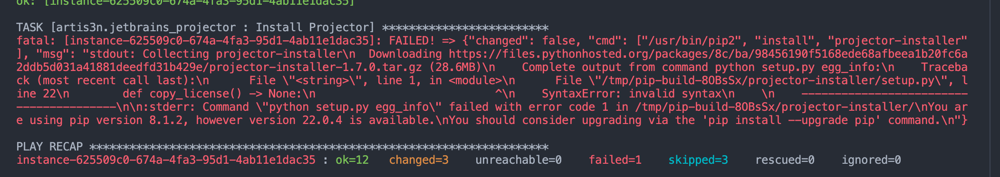

# CentOS 7 Ansible Test Image - Python 3

CentOS 7 Docker container for Ansible playbook and role testing using Python 3.10.

Note that this container is brittle and is built only to allow for CI testing of Centos 7 in https://github.com/artis3n/ansible-role-jetbrains-projector until Centos 7 reaches EOL, this container breaks, or I stop working on that role.

Setting `ansible_python_interpreter` to `usr/bin/python3`, still getting Python 2 issues on Centos 7 here so :shrug: we'll see if I resolve this in the future.

## Tags

  - `latest`: Latest stable version of Ansible, on Python 3.10.

## How to Build

This image is built weekly automatically and any time a commit is made or merged to the `master` branch. But if you need to build the image on your own locally, do the following:

  1. [Install Docker](https://docs.docker.com/engine/installation/).
  2. `cd` into this directory.
  3. Run `docker build -t centos7-ansible-py3 .`

## How to Use

  1. [Install Docker](https://docs.docker.com/engine/installation/).
  2. Pull this image from Docker Hub: `docker pull ghcr.io/artis3n/docker-centos7-ansible-py3:latest` (or use the image you built earlier, e.g. `centos7-ansible-py3:latest`).
  3. Run a container from the image: `docker run --detach --privileged --volume=/sys/fs/cgroup:/sys/fs/cgroup:ro ghcr.io/artis3n/docker-centos7-ansible-py3:latest`.
  4. Use Ansible inside the container:
    a. `docker exec --tty [container_id] env TERM=xterm ansible --version`
    b. `docker exec --tty [container_id] env TERM=xterm ansible-playbook /path/to/ansible/playbook.yml --syntax-check`

## Notes

I use Docker to test my Ansible roles and playbooks on multiple OSes using CI tools like Jenkins and Travis. This container allows me to test roles and playbooks using Ansible running locally inside the container.

> **Important Note**: I use this image for testing in an isolated environment—not for production—and the settings and configuration used may not be suitable for a secure and performant production environment. Use on production servers/in the wild at your own risk!

## Author

This was forked from [Jeff Geerling](https://www.jeffgeerling.com/)'s <https://github.com/geerlingguy/docker-centos7-ansible>.
